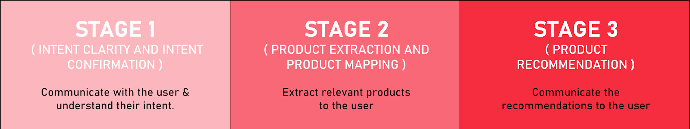
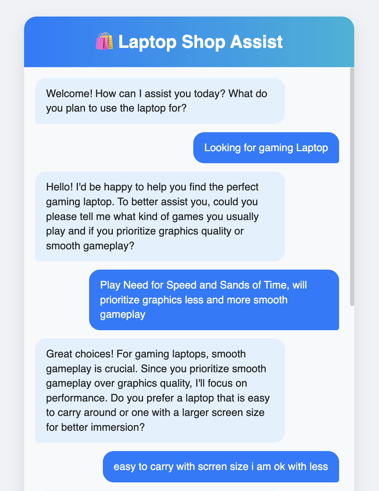
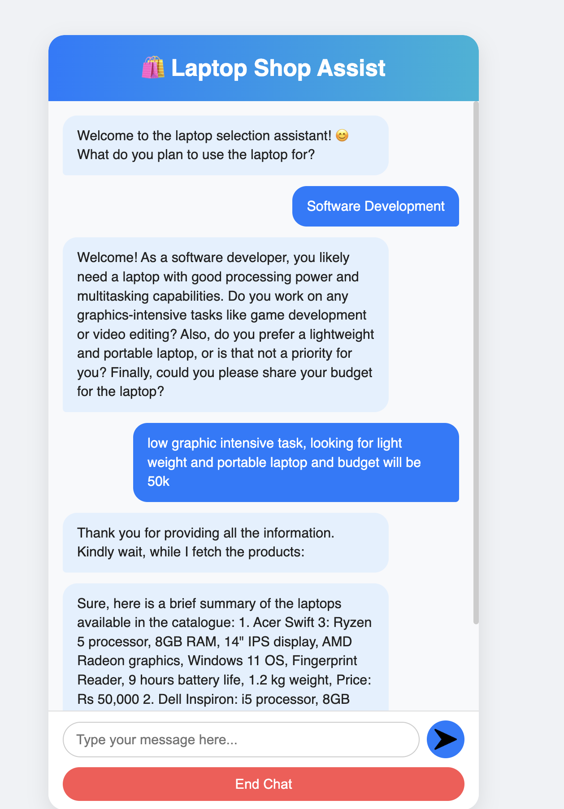
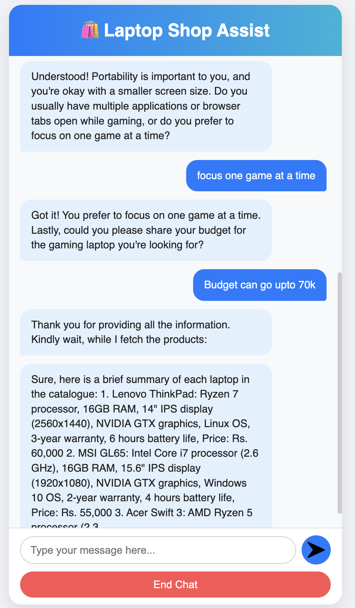

# GenAI_based_Shopping_Assistant


 Problem Statement
Given a dataset containing information about laptops (product names, specifications, descriptions, etc.), build a chatbot that parses the dataset and provides accurate laptop recommendations based on user requirements.

 Approach
1. **Conversation and Information Gathering:** Start by engaging the user in a natural conversation to understand their laptop needs and preferences.
2. **Profile Extraction:** Use language models and rule-based logic to extract a structured user profile from the conversation.
3. **Laptop Matching:** Compare the user profile against the dataset to identify the top 3 laptops that best fit the requirements.
4. **Personalized Dialogue and Recommendation:** Continue the conversation, present recommendations, and address follow-up questions to help the user make an informed choice.

## System Functionalities

- **User Interface:** ShopAssistAI features a Flask-powered web interface that enables seamless, real-time conversation with users through a chat-based UI rendered via HTML templates.
- **Intelligent Conversation Flow:** The system employs OpenAI's GPT-3.5 Turbo model with carefully calibrated parameters (temperature=0.3, presence_penalty=0.1) to deliver consistent, focused guidance while gathering user requirements through structured prompting.
- **Multi-stage Moderation:** User inputs undergo OpenAI moderation API screening with immediate conversation termination for flagged content, ensuring conversation safety at every interaction point.
- **Structured Data Extraction:** The system leverages OpenAI function calling with custom JSON schemas to accurately convert natural language requirements into structured attribute classifications (GPU, display, portability, multitasking, processing) with standardized low/medium/high values.
- **Advanced Recommendation Engine:** The application employs a weighted scoring algorithm that filters laptops by budget constraints before applying feature-matching logic, calculating compatibility scores, and returning the top 3 matches.

- We have a dataset `laptop_inventory.csv` where each row describes the features of a single laptop and also has a small description at the end. The chatbot will leverage large language models to parse this `Description` column and provide recommendations.

 System Architecture

ShopAssistAI uses a client-server setup with a Flask web interface, connecting to OpenAI's API for chat and moderation, and accessing laptop data from an external database.



 Implementation Details

The Flask application utilizes various functionalities:

- **Routing:** Maps user requests to appropriate functions based on URLs.
- **Conversation Management:** Handles conversation initiation, response generation through OpenAI's chat model, and conversation history maintenance.
- **User Input Processing:** Captures user input, performs moderation checks, and extracts user profiles from conversation history (converting user input string to JSON using OpenAI Function calling).
- **Recommendation Logic:** Compares user profiles with laptop data, validates recommendations, and generates recommendation text.

  ### Major Functions
### Major Functions

- `initialize_conversation()`: Creates and returns the initial conversation array with a structured system prompt that guides the AI's behavior throughout the recommendation process.
- `get_chat_model_completions(messages)`: Sends conversations to OpenAI's GPT-3.5-Turbo with optimized parameters (temperature=0.3, presence_penalty=0.1) to generate contextually appropriate responses within a 150 token limit.
- `moderation_check(user_input)`: Utilizes OpenAI's moderation API to screen all text for policy violations, returning "Flagged" status to trigger conversation termination when necessary.
- `intent_confirmation_layer(response_assistant)`: Analyzes assistant responses to verify if all six required attributes (5 laptop specifications plus budget) are present and correctly formatted.
- `get_user_requirement_string(response_assistant)`: Extracts and standardizes the user's requirements from natural language into a structured format using a specialized prompt.
- `get_chat_completions_func_calling(input, include_budget)`: Implements OpenAI function calling to reliably parse user requirements into a structured JSON schema with standardized attribute values.
- `compare_laptops_with_user(user_requirements)`: Processes laptop inventory data, filters by budget constraints, and applies a scoring algorithm to identify the top three matching laptops based on feature compatibility.
- `product_map_layer(laptop_description)`: Converts raw laptop descriptions into standardized feature classifications (low/medium/high) for each requirement category using defined classification rules.
- `recommendation_validation(laptop_recommendation)`: Filters recommended laptops to ensure only those with compatibility scores above a minimum threshold are presented to users.
- `initialize_conv_reco(products)`: Creates a new conversation context for the recommendation phase, formatting product details for optimal presentation to the user.

### Prerequisites
- Python 3.7+
- OpenAI API Key(you have to add openai api key in the empty txt file (OpenAI_API_Key))

### Getting Started

To get started with ShopAssist AI, follow these steps:

 **Clone the repository:**
   ```
   git clone <Repository URL>
   cd ProjectFolder
   ```

 **Install dependencies:**
```   
pip install Flask openai pandas
```
**Initialize the conversation:**  
```
python ShopAssistApplication.py
```

## Appendix - B

User output example screenshot:









